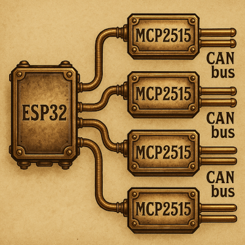

# esp32-can-mcp2515-multi
Extended CAN driver for ESP32 using multiple MCP2515 controllers over SPI.

Supports independent or parallel operation of several CAN buses with shared SPI interface and separate CS/INT lines.
Designed for ESP-IDF framework (C language).



High-level multi-device MCP2515 library for ESP-IDF with a stable public 
interface and a separate internal backend. 
Supports multiple MCP2515 controllers on one or more SPI buses, numeric bus/device IDs, and a thin facade API (`canif_*`) for messaging and control.

**Note:** While designed for multi-device setups, this library is equally well-suited for single MCP2515 device applications. The unified API provides a clean, consistent interface regardless of the number of devices.

## Headers and layering

- Public API: `mcp2515_multi.h`
  - Configuration types: `mcp_spi_bus_config_t`, `mcp2515_device_config_t`, `mcp2515_bundle_config_t`
  - Numeric IDs/handles: `can_bus_id_t`, `can_dev_id_t`, `can_bus_handle_t`, `can_dev_handle_t`, `can_target_t`
  - Registry/lifecycle: `canif_register_bundle`, `canif_open_device`, `canif_open_all` ...
  - Messaging: `canif_send_to`, `canif_receive_from`, also `*_id`/`*_target`
  - Mode/bitrate, events, errors, filters/masks
  - Helper type: `can_message_t`

- Internal backend: `mcp2515_multi_internal.h`
  - Low-level SPI/MCP2515 control: `MCP2515_*` API
  - Not exported to users; subject to change

## Hardware notes
- A 120-ohm termination resistor should be placed at **one** end of the bus **only**!
- Custom GPIO assignments are configurable (see [examples/config_send.h](examples/config_send.h) and [examples/config_receive.h](examples/config_receive.h) for templates).
- Either SPI2 or SPI3 may be used (SPI1 is reserved for flash on most ESP32 variants).
- Supported ESP32 variants: ESP32, ESP32-S2, ESP32-S3, ESP32-C3, ESP32-C6, and other ESP-IDF compatible chips.
- Each MCP2515 device requires a CS (Chip Select) pin; optionally an INT (Interrupt) pin for event-driven reception.

### Tested Hardware Configuration

This library has been successfully tested with the following hardware setup:

**Microcontroller:**
- [Waveshare ESP32-S3-Pico](https://www.waveshare.com/esp32-s3-pico.htm) (Model: 23803)
  - [Product Page](https://www.waveshare.com/esp32-s3-pico.htm)
  - [Wiki Documentation](https://www.waveshare.com/wiki/ESP32-S3-Pico)

**CAN Modules:**
- 5x [Adafruit CAN Bus BFF](https://learn.adafruit.com/adafruit-can-bus-bff) modules
  - 3 modules configured as receivers (RX)
  - 2 modules configured as transmitters (TX)
  - Uses MCP25625 integrated circuit (combines MCP2515 CAN controller + MCP2551 CAN transceiver)
  - **Important:** STBY/A1 pin connected to ground on all modules for normal operation mode

## Quick start

**Note:** These instructions work for both single and multiple MCP2515 devices. For a single device, simply configure a bundle with `device_count = 1`.

1) Provide bundle configuration (one SPI bus + N devices), ideally as a `const` in a header near your example/app:

```c
extern const mcp2515_bundle_config_t CAN_HW_CFG; // see examples for templates
```

2) Initialize and open all devices in the bundle:

```c
#include "mcp2515_multi.h"

canif_multi_init_default(&CAN_HW_CFG); // registers bundle and opens all devices
```

3) Send/receive per device:

```c
can_bus_handle_t bus = canif_bus_default();
for (size_t i = 0; i < canif_bus_device_count(bus); ++i) {
    can_dev_handle_t dev = canif_device_at(bus, i);
    can_message_t msg = { .id = 0x123, .dlc = 2, .data = { 0xDE, 0xAD } };
    (void)canif_send_to(dev, &msg);
}
```

## Naming conventions

- Public facade functions: `canif_*`
- Public configuration types: `mcp_*` (bus/device/bundle)
- Identifiers and messages: `can_*` (`can_message_t`, `can_bus_id_t`, ...)
- Internal backend: `MCP2515_*`, `ERROR_t`

## Project Structure

```
esp32-can-mcp2515-multi/
├── CMakeLists.txt              # Main library component
├── idf_component.yml           # Component metadata
├── include/
│   ├── mcp2515_multi.h         # Public API header
│   └── can_message.h           # CAN message definition
├── src/
│   ├── mcp2515_multi.c         # Public API implementation
│   ├── mcp2515_multi_internal.c # Backend implementation
│   └── mcp2515_multi_internal.h # Backend header (internal use only)
├── components/
│   └── examples_utils/         # Utility functions for examples
│       ├── CMakeLists.txt
│       ├── examples_utils.h
│       └── examples_utils.c
└── examples/
    ├── config_send.h           # HW config for send example
    ├── config_receive.h        # HW config for receive examples
    ├── send/
    │   ├── CMakeLists.txt      # ESP-IDF project file
    │   └── main/
    │       ├── CMakeLists.txt  # Main component
    │       └── main.c          # Application code
    ├── receive_poll/
    │   ├── CMakeLists.txt
    │   └── main/
    │       ├── CMakeLists.txt
    │       └── main.c
    └── receive_interrupt/
        ├── CMakeLists.txt
        └── main/
            ├── CMakeLists.txt
            └── main.c
```

## Build (ESP-IDF component)

- The library is structured as an ESP-IDF component in the project root.
- Include directory (`include/`) exports only the public headers; internal backend is not intended for direct use.
- Component depends on `driver`, `freertos`, `esp_timer`.
- Can be used in other projects by adding the component directory to `EXTRA_COMPONENT_DIRS`.

## Using the Library in Your Project

### Method 1: Copy Component to Your Project

1. Copy the entire library directory to your project's `components/` folder:
   ```bash
   cp -r esp32-can-mcp2515-multi /path/to/your-project/components/
   ```

2. Include the header in your code:
   ```c
   #include "mcp2515_multi.h"
   ```

3. The library will be automatically found by the ESP-IDF build system.

**Tip:** This approach works perfectly for projects with just one CAN device - the library overhead is minimal.

### Method 2: Reference as External Component

1. In your project's `CMakeLists.txt`, add the library path to `EXTRA_COMPONENT_DIRS`:
   ```cmake
   set(EXTRA_COMPONENT_DIRS /path/to/esp32-can-mcp2515-multi)
   ```

2. Include the header in your code:
   ```c
   #include "mcp2515_multi.h"
   ```

### Method 3: ESP Component Registry (Future)

When published to the ESP Component Registry, install via:
```bash
idf.py add-dependency "esp32-can-mcp2515-multi"
```

## Examples

All examples are located in the `examples/` directory. Each example demonstrates different aspects of multi-MCP2515 operation.

### Hardware Configuration

**Important:** Hardware configuration (GPIO pins, SPI speed, MCP2515 crystal frequency, CAN bitrate) is defined in configuration header files located in the `examples/` directory:
- [examples/config_send.h](examples/config_send.h) - Configuration for send example (2 TX devices on SPI3)
- [examples/config_receive.h](examples/config_receive.h) - Configuration for receive examples (3 RX devices on SPI2)

You **must** adapt these configuration files to match your hardware setup before building the examples.

**Note:** These config files are included by the example applications using relative paths (e.g., `#include "config_send.h"` from [examples/send/main/main.c](examples/send/main/main.c)).

Configuration includes:
- **SPI bus wiring**: MISO, MOSI, SCLK pins
- **Device-specific pins**: CS (Chip Select), INT (Interrupt), optional STBY/RST
- **SPI parameters**: Clock speed (typically 10 MHz), mode, DMA channel
- **MCP2515 hardware**: Crystal frequency (`MCP_8MHZ`, `MCP_16MHZ`, or `MCP_20MHZ`)
- **CAN parameters**: Bitrate (e.g., `CAN_500KBPS`, `CAN_1000KBPS`), loopback mode

### Environment Setup

Before building any example, initialize the ESP-IDF environment:

```bash
# Activate ESP-IDF environment (adjust path to your installation)
source ~/esp/esp-idf/export.sh
# Or for specific version:
source ~/esp/v5.4.1/esp-idf/export.sh
```

### Target Configuration

Set the target ESP32 chip variant before the first build:

```bash
# For ESP32 (original)
idf.py set-target esp32

# For ESP32-S3
idf.py set-target esp32s3

# For ESP32-C3
idf.py set-target esp32c3

# For ESP32-S2
idf.py set-target esp32s2

# For ESP32-C6
idf.py set-target esp32c6
```

**Note:** After changing the target, you need to reconfigure the project (this is done automatically on the next build).

### Serial Port Configuration

Find your USB-to-serial port (varies by system):
```bash
# Linux: typically /dev/ttyUSB0, /dev/ttyUSB1, or /dev/ttyACM0
ls /dev/ttyUSB* /dev/ttyACM*

# macOS: typically /dev/cu.usbserial-* or /dev/cu.SLAB_USBtoUART
ls /dev/cu.*

# Windows: typically COM3, COM4, etc. (check Device Manager)
```

### Example 1: Send 
Sending CAN messages to multiple independent buses (polling transmission).

**Hardware configuration:** Edit [examples/config_send.h](examples/config_send.h) - 2 MCP2515 devices on SPI3 (TX only, no interrupt pins).

**Application code:** [examples/send/main/main.c](examples/send/main/main.c)

```bash
cd examples/send
idf.py set-target esp32s3        # Set your target chip
idf.py build                      # Build the project
idf.py -p /dev/ttyUSB0 flash      # Flash to device
idf.py -p /dev/ttyUSB0 monitor    # Monitor output (Ctrl+] to exit)
```

Or combine flash and monitor:
```bash
idf.py -p /dev/ttyUSB0 flash monitor
```

### Example 2: Receive Poll
Receiving CAN messages from multiple buses using the polling method (no interrupts).

**Hardware configuration:** Edit [examples/config_receive.h](examples/config_receive.h) - 3 MCP2515 devices on SPI2 (with interrupt pins defined but not used in this example).

**Application code:** [examples/receive_poll/main/main.c](examples/receive_poll/main/main.c)

```bash
cd examples/receive_poll
idf.py set-target esp32s3        # Set your target chip
idf.py -p /dev/ttyUSB0 flash monitor
```

### Example 3: Receive Interrupt
Receiving CAN messages from multiple buses using interrupt-driven reception (most efficient).

**Hardware configuration:** Edit [examples/config_receive.h](examples/config_receive.h) - 3 MCP2515 devices on SPI2 with INT pins connected.

**Application code:** [examples/receive_interrupt/main/main.c](examples/receive_interrupt/main/main.c)

```bash
cd examples/receive_interrupt
idf.py set-target esp32s3        # Set your target chip
idf.py -p /dev/ttyUSB0 flash monitor
```

### Building with VS Code / Cursor (ESP-IDF Extension)

If you prefer GUI-based development, you can use VS Code or Cursor with the ESP-IDF extension:

**Example 1: Send (using ESP-IDF extension)**
1. Open the example folder: `File → Open Folder → examples/send/`
2. Set target: `Ctrl+Shift+P` → `ESP-IDF: Set Espressif Device Target` → select `esp32s3`
3. Edit hardware configuration in [examples/config_send.h](examples/config_send.h) according to your setup
4. Select serial port: `Ctrl+Shift+P` → `ESP-IDF: Select Port to Use` → select your port
5. Build, flash and monitor: `Ctrl+Shift+P` → `ESP-IDF: Build, Flash and Monitor`

**Note:** 
- Examples 2 and 3 follow the same procedure - just open their respective folders.
- Edit [examples/config_receive.h](examples/config_receive.h) for receive examples.
- Application code is in `main/main.c` subdirectory within each example.

**Linux users:** If you get "Permission denied" on `/dev/ttyUSB0`, add your user to the dialout group:
```bash
sudo usermod -a -G dialout $USER
# Log out and log back in for changes to take effect
```

### Menuconfig (Optional)

You can access advanced ESP-IDF configuration options:
```bash
idf.py menuconfig
```

Or via ESP-IDF extension: `Ctrl+Shift+P` → `ESP-IDF: SDK Configuration Editor (Menuconfig)`

This allows you to configure:
- FreeRTOS task parameters
- Stack sizes
- Logging levels
- CPU frequency
- And many other system parameters

## Features

- ✅ **Scalable design** - works seamlessly with single or multiple MCP2515 devices
- ✅ **Multiple MCP2515 devices** on shared or independent SPI buses
- ✅ **Flexible addressing** via numeric IDs, handles, or composite targets
- ✅ **Registry-based** device management with lookup functions
- ✅ **Event-driven or polling** reception modes
- ✅ **Hardware filtering** with configurable acceptance filters and masks
- ✅ **Runtime reconfiguration** of bitrate and operating mode
- ✅ **Standard and extended** CAN frame support (11-bit and 29-bit IDs)
- ✅ **Interrupt support** for efficient message reception
- ✅ **Tested on** ESP32, ESP32-S2, ESP32-S3, ESP32-C3, ESP32-C6
- ✅ **Comprehensive examples** with utility functions and statistics

## Acknowledgments

This project is based on the excellent work of [Microver Electronics](https://github.com/Microver-Electronics/mcp2515-esp32-idf).
Their original [mcp2515-esp32-idf](https://github.com/Microver-Electronics/mcp2515-esp32-idf) project provided the foundation for this extended multi-bus version.
Both projects are distributed under the [MIT License](./LICENSE).


## License
MIT License — see [LICENSE](LICENSE)

---

*Author: Ivo Marvan, 2025*
